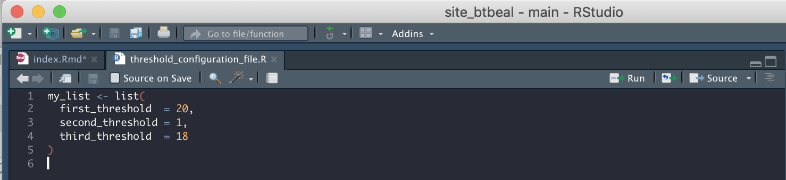
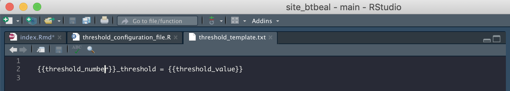
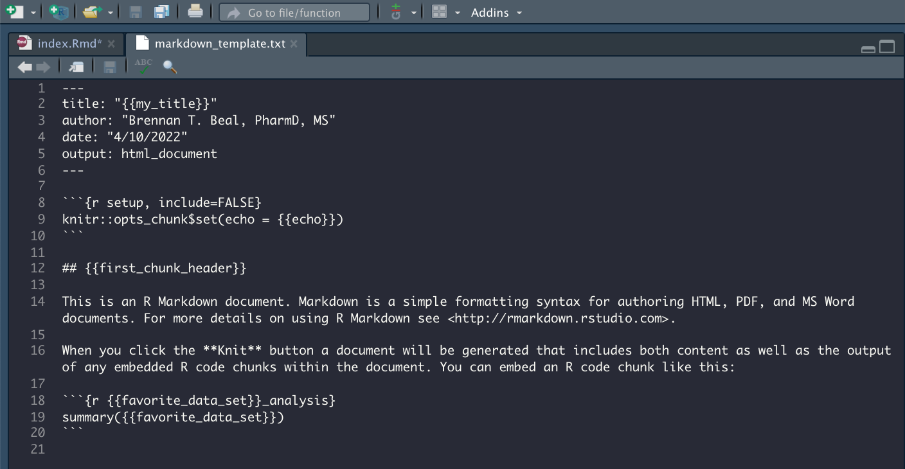

```{r setup, include=FALSE}
knitr::opts_chunk$set(echo = TRUE)
library(whisker)
library(magrittr)
library(dplyr)

```

## Tl;dr  
  
**The whisker package is a super powerful, but incredibly simple package that allows us to edit text files and render them as either `.R` or `.Rmd` files. Using whisker, we can parameterize any type of file we like. Currently, I use this to update configuration files as well as create new report templates. In the blog, I demonstrate how to edit both!**

## The Business Case  
  
I recently ran into a problem at work where we were creating a pretty massive reporting architecture, with each new module requiring, more or less, copying, and pasting, a new `.Rmd` file, adding thresholds to a config file, and updating an initialize file. All of these files were intuitive (I hope!) and easy to find within the directory. But, for a new developer to the team, I could imagine how maintaining the platform (or providing updates) would become pretty burdensome fairly quickly.  
  
So, with the general rule in mind, if you're copying and pasting, you're doing it wrong, I began to think of ways to semi-automate this process. The first, and most obvious way, is to simply create `.Rmd` [templates](https://bookdown.org/yihui/rmarkdown-cookbook/package-template.html). There are multiple examples and tutorials of how to do this but they didn't quite satiate my developer desires. Mainly, I didn't just need to create markdown files, I also needed to update other `.R.` files - the config and initializing files I mentioned. In addition, the markdown files needed to be slightly more customizable than I was prepared to deal with through the simple yaml constructs. Last, I wanted a simple function to open and render all these things with a simple function that other developers would have access to. All signs pointed to a solution slightly beyond the scope of `.Rmd` templates.  
  
I realized that what I was looking for could be solved by making use of the [whisker](https://github.com/edwindj/whisker) package, which is a [{{Mustache}}](https://mustache.github.io/) R implementation - extremely elegant but powerful for the work that I needed to do. I should also mention that the other functions I'll discuss are already implemented in base R so... go R!  
  
Before I demonstrate how I've used whisker, I should mention that I'm assuming the basics: you're familiar with the general [project](https://r4ds.had.co.nz/workflow-projects.html) workflow, which allows users the ability to use relative paths and read/write objects within it. Additionally, If you're trying to parameterize R reports, I'm assuming you have basic familiarity with the language and data manipulation. If not, feel free to pioneer through. But, I won't spend a ton of time explaining the basics.   
  
## The Basics  
  
 
Before reading and writing files, let's just check out the basics... In general, the mustach syntax allows users to read and write templated text files using `{{}}` syntax for additional parameters. So, a simple example may look like this:  
  
```{r simple_example}
# Create a text template:
my_cool_template <- "Hey, have you met my friend {{best_friend}}? They're the best!"  

# Use whisker::whisker.render() to pass that template as well as the parameters, to output new text!
whisker.render(template = my_cool_template, data = list(best_friend = 'Brennan'))

```
  
That's it - so simple! We can take any text template (or any file, as we'll see) and parameterize it. Of course, it's unlikely that in a data science role, you're going to want everything in one file (as above). We want to modularize, and functionalize this. So, before we can do that, I want to introduce you to a couple more functions that'll be required to full-scale this thing.  
  
First, we should note that the goal is to both create as well as modify some files. To do this, we'll need to turn the files into text, edit them with whisker, then write them back in their original form. To demo that, I'll need to create some standard files to play with. Let's create a mock file with a list of thresholds (this is just an example of something we'd like to make changes to periodically).  
  
First, we'll just create a list of fake thresholds (for some cool project we're working on). Then, we'll write that object to a `.R` file (just to practice reading/writing that file).  
  
```{r, eval = FALSE}
# First, create a new .R file:
# (notice, i'm using './' as a relative path in my project - you should too!)
file.create('./threshold_configuration_file.R')

# Now, add a simple list to it and save:
my_list <- list(
  first_threshold  = 20,
  second_threshold = 1,
  third_threshold  = 18
)
```

  
As a note, when writing this file, you'll need to leave the last line blank:  
  
  
  
If we don't leave this line blank, we'll receive the following error when trying to read it in:  

`incomplete final line found on './threshold_configuration_file.R'`  
  
Finally, now that we've got our configuration file set up, we'll need to create a template we'd like to use to update the file. From there, the fun part begins.  
  
Recall that whisker requires a text template to update our function. No worries! We can do this in the same way:  
  
```{r, eval = FALSE}
file.create('./threshold_template.txt')
```

Then, add our text template with the parameters in mind:  
  
  
  
Great - we're all set up!

## The cool part  
  
Now that we've created all the files we need, a `.R` file we want to update, and a `.txt` file with the template we'll use to update our `.R` file, we're ready to go.  
  
First, let's read in our `.R` file to show you that it really is just text:  
  
```{r}
(threshold_lines <- readLines('./threshold_configuration_file.R'))
```
  
  
Notice that this gives us a vector with strings, which represent each line in the file. That means that this object can be indexed and treated like any other vector. For example, if I wanted to find what the third line of this `.R` file was, I could simply... 
  
```{r}
threshold_lines[3]
```

Knowing this, breaking the file down, and editing it with whisker, should seem as simple as our first example! So, let's say that we want to add a new threshold to the final part of that list. First, we'll have to find the end of the list (which requires some knowledge of the list itself, which we have), then, we can break the list into parts, insert our template, then put it all back together!  
  
Because we created this list, and the example is meant to be simple, we know that the end of the list will the the part of our vector with a closed parentheses, `)`. So, let's insert something between that and the last line of text.
  
```{r}
# last line:  
(last_line_index <- grep(')', threshold_lines))
```
  
Okay, the last line is the fifth line. Let's use that to store the end and beginning of our new text:  
  
```{r}
# The beginning is everything before the last line:
beginning_text <- threshold_lines[1:last_line_index - 1]

# The end is... the last line:
end_text <- threshold_lines[last_line_index]
```
  
Now, we can create a new string to insert with whisker, and call that the middle line. Let's say we want to add a 'fourth_threshold' with a value of 82 to our file. 
  
```{r}
middle_line <- whisker.render(template = readLines('./threshold_template.txt'), 
               data = list(threshold_number = 'fourth',
                           threshold_value = 82))
```

Reassembly now, is **almost** trivial. Can you spot the issue with our new output?  
  
```{r}
writeLines( c(beginning_text, middle_line,  end_text))
```
  

Since we're adding something to a list, our second to last item (and previously last item) should have a trailing comma. We can simply overwrite the object's final entry as so:  

```{r}
beginning_text[last_line_index-1] <- paste0(beginning_text[last_line_index-1], ',')

# Take a look:
writeLines(c(beginning_text, middle_line,  end_text))
```

  
Now, we can add all these together an overwite our previous threshold file with `writeLines()`:  
  
```{r, eval = FALSE}
writeLines(c(beginning_text, middle_line,  end_text), con = './threshold_configuration_file.R')
```
  
## Parameterised RMarkdown files  
  
Seeing how to read, edit, and write back lines to a chunk of code should make this part feel familiar, so i won't spend a ton of time. But, since I mentioned that I use this to generate markdown temmplates as well as update config files, I may as well show you both!  
  
We already have the toolkit in hand. So, I'll just provide some snapshots. First, let's create our text file that accepts a number of input parameters for whisker:  
  
  
  
The thing to notice here is that we can modify *any* part of the markdown file because **it is just text**. So now, the drill is the same, read it in, and edit it. Let's see:  
  
```{r}
writeLines(whisker.render(template = readLines('./markdown_template.txt'),
               data = list(
                 my_title = 'New title!',
                 echo = TRUE,
                 first_chunk_header = "Initial Analysis",
                 favorite_data_set = 'mtcars'
               )))
```

So helpful. So now, I can have a base template that I'd like to slightly modify for different use cases, but generally keep the same. Of course, in your workflow you'll want to save this file as a `.Rmd` as so:  
  
```{r, eval = FALSE}
writeLines(whisker.render(template = readLines('./markdown_template.txt'),
               data = list(
                 my_title = 'New title!',
                 echo = TRUE,
                 first_chunk_header = "Initial Analysis",
                 favorite_data_set = 'mtcars'
               )),
           con = './new_markdown.Rmd')
```
  

For my current job at Flatiron Health, I use this workflow to create new reports in a large reporting architecture. Whisker has made my life a lot easier.
  
In the next section, I'll demonstrate how to functionalize all of this and then we'll wrap it up.  
  

## Functionalize it!

Since we can do this all manually, the final part to making this speedy is to functionalize it! Notice that all these inputs are really just standard parameters we could add to a function. So... let's do it!  
  
```{r}
update_thresholds <- function(.my_title,
                              .echo,
                              .first_chunk_header,
                              .favorite_data_set,
                              .output_path,
                              .file_path_template){
  
  # Assemble the pieces:  
  writeLines(whisker.render(template = readLines(.file_path_template),
                            data = list(
                              my_title = .my_title,
                              echo = .echo,
                              first_chunk_header = .first_chunk_header,
                              favorite_data_set = .favorite_data_set
                            )),
             con = .output_path)
  
  # I like to open the file for the user...
  file.edit(.output_path)
  
}
```


Try it out!  
  

## In closing  
  
Knowing how to read in files as text, edit them with a template, and then reopen the edited file has become incredibly important in my day-to-day workflow as my team continues to build out a fairly large reporting architecture. We're able to use a function similar to this (though a bit more complex), to open and edit `.Rmd` files, `.R` files, and anything else we'd like all with a few text templates and whisker!  
  
Of course, in this tutorial I only covered a few examples but the possibilities are endless! Create a text template, and use whisker to edit it.
  
Happy programming,  
-B

